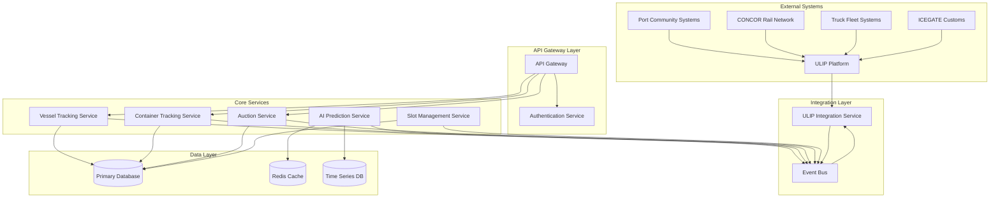

# Design Document: National Port-to-Shelf Optimizer

## Overview

The National Port-to-Shelf Optimizer is a cloud-based microservices architecture that coordinates multimodal logistics across India's shipping, rail, and road networks. The system integrates with ULIP (Unified Logistics Interface Platform) as the central data exchange hub, enabling real-time visibility and dynamic resource allocation through AI-powered arrival predictions and automated slot auctions.

The architecture follows event-driven patterns with asynchronous communication, ensuring scalability and resilience. Core components include vessel tracking, container lifecycle management, AI prediction engine, auction mechanism, and ULIP integration layer.

## Architecture

### High-Level Architecture



### Technology Stack

- **API Gateway**: Kong or AWS API Gateway
- **Services**: Node.js/TypeScript or Python (FastAPI)
- **Event Bus**: Apache Kafka or AWS EventBridge
- **Primary Database**: PostgreSQL with PostGIS extension
- **Cache**: Redis
- **Time Series DB**: InfluxDB or TimescaleDB
- **AI/ML**: Python with TensorFlow/PyTorch, scikit-learn
- **Container Orchestration**: Kubernetes
- **Cloud Provider**: AWS, Azure, or GCP

## Components and Interfaces

### 1. API Gateway

**Responsibility**: Entry point for all external requests, handles routing, rate limiting, and initial authentication.

**Interfaces**:
```typescript
interface APIGatewayConfig {
  routes: Route[];
  rateLimits: RateLimitConfig;
  corsPolicy: CORSPolicy;
}

interface Route {
  path: string;
  method: HTTPMethod;
  targetService: string;
  authRequired: boolean;
  roles: Role[];
}
```

### 2. Authentication Service

**Responsibility**: Manages user authentication, authorization, and role-based access control.

**Interfaces**:
```typescript
interface AuthService {
  authenticate(credentials: Credentials): Promise<AuthToken>;
  validateToken(token: string): Promise<TokenValidation>;
  authorize(token: string, resource: string, action: string): Promise<boolean>;
}

interface Credentials {
  username: string;
  password: string;
}

interface AuthToken {
  accessToken: string;
  refreshToken: string;
  expiresIn: number;
  userId: string;
  roles: Role[];
}

enum Role {
  RETAILER = "RETAILER",
  PORT_OPERATOR = "PORT_OPERATOR",
  TRANSPORT_COORDINATOR = "TRANSPORT_COORDINATOR",
  SYSTEM_ADMINISTRATOR = "SYSTEM_ADMINISTRATOR"
}
```

### 3. Vessel Tracking Service

**Responsibility**: Tracks vessel positions, manages vessel registry, and monitors arrival status.

**Interfaces**:
```typescript
interface VesselTrackingService {
  registerVessel(vessel: VesselRegistration): Promise<Vessel>;
  updatePosition(vesselId: string, position: Position): Promise<void>;
  getVessel(vesselId: string): Promise<Vessel>;
  listActiveVessels(): Promise<Vessel[]>;
  recordArrival(vesselId: string, portId: string, timestamp: Date): Promise<void>;
}

interface Vessel {
  id: string;
  name: string;
  imoNumber: string;
  currentPosition: Position;
  estimatedArrival: EstimatedArrival;
  containerManifest: ContainerManifest;
  status: VesselStatus;
}

interface Position {
  latitude: number;
  longitude: number;
  timestamp: Date;
  speed: number; // knots
  heading: number; // degrees
}

interface EstimatedArrival {
  portId: string;
  estimatedTime: Date;
  confidenceInterval: number; // hours
  lastUpdated: Date;
}

enum VesselStatus {
  EN_ROUTE = "EN_ROUTE",
  ARRIVED = "ARRIVED",
  BERTHED = "BERTHED",
  DEPARTED = "DEPARTED"
}
```

### 4. Container Tracking Service

**Responsibility**: Manages container lifecycle, tracks movements across transport modes, and provides visibility.

**Interfaces**:
```typescript
interface ContainerTrackingService {
  createContainer(container: ContainerRegistration): Promise<Container>;
  updateTransportMode(containerId: string, mode: TransportMode, location: Location): Promise<void>;
  getContainerJourney(containerId: string): Promise<Journey>;
  queryContainers(query: ContainerQuery): Promise<Container[]>;
  markDelivered(containerId: string, warehouseId: string, timestamp: Date): Promise<void>;
}

interface Container {
  id: string; // ISO 6346 format
  ownerId: string; // Retailer ID
  currentLocation: Location;
  currentMode: TransportMode;
  status: ContainerStatus;
  journey: JourneyEvent[];
  demurrageInfo: DemurrageInfo;
}

interface Location {
  type: LocationType;
  id: string; // UN/LOCODE
  name: string;
  coordinates: Position;
}

enum LocationType {
  PORT = "PORT",
  RAIL_TERMINAL = "RAIL_TERMINAL",
  WAREHOUSE = "WAREHOUSE",
  IN_TRANSIT = "IN_TRANSIT"
}

enum TransportMode {
  VESSEL = "VESSEL",
  RAIL = "RAIL",
  TRUCK = "TRUCK"
}

enum ContainerStatus {
  ON_VESSEL = "ON_VESSEL",
  AT_PORT = "AT_PORT",
  ON_RAIL = "ON_RAIL",
  ON_TRUCK = "ON_TRUCK",
  DELIVERED = "DELIVERED"
}

interface JourneyEvent {
  timestamp: Date;
  eventType: string;
  location: Location;
  transportMode: TransportMode;
  metadata: Record<string, any>;
}

interface DemurrageInfo {
  arrivalAtPort: Date;
  freeTimeHours: number;
  demurrageStartTime: Date;
  demurrageCost: number;
  isPriority: boolean;
}
```

### 5. AI Prediction Service

**Responsibility**: Generates vessel arrival predictions using machine learning models and historical data.

**Interfaces**:
```typescript
interface PredictionService {
  predictArrival(vesselId: string): Promise<ArrivalPrediction>;
  updatePrediction(vesselId: string, newData: VesselData): Promise<ArrivalPrediction>;
  evaluatePredictionAccuracy(vesselId: string, actualArrival: Date): Promise<AccuracyMetrics>;
  trainModel(historicalData: TrainingData[]): Promise<ModelMetrics>;
}

interface ArrivalPrediction {
  vesselId: string;
  portId: string;
  predictedArrivalTime: Date;
  confidenceInterval: number; // hours
  confidence: number; // 0-1
  factors: PredictionFactors;
  generatedAt: Date;
}

interface PredictionFactors {
  currentSpeed: number;
  distanceRemaining: number; // nautical miles
  weatherConditions: WeatherData;
  historicalAverageSpeed: number;
  portCongestion: number; // 0-1
}

interface WeatherData {
  windSpeed: number;
  waveHeight: number;
  visibility: number;
  forecast: string;
}

interface AccuracyMetrics {
  vesselId: string;
  predictedTime: Date;
  actualTime: Date;
  errorHours: number;
  withinThreshold: boolean;
}
```

### 6. Auction Service

**Responsibility**: Manages slot auctions, processes bids, and assigns slots to winners.

**Interfaces**:
```typescript
interface AuctionService {
  createAuction(auction: AuctionCreation): Promise<Auction>;
  submitBid(bid: BidSubmission): Promise<Bid>;
  closeAuction(auctionId: string): Promise<AuctionResult>;
  getAuction(auctionId: string): Promise<Auction>;
  listActiveAuctions(retailerId?: string): Promise<Auction[]>;
}

interface Auction {
  id: string;
  vesselId: string;
  portId: string;
  slots: Slot[];
  startTime: Date;
  endTime: Date;
  status: AuctionStatus;
  bids: Bid[];
}

interface Slot {
  id: string;
  transportMode: TransportMode;
  origin: string; // UN/LOCODE
  destination: string; // UN/LOCODE
  departureTime: Date;
  capacity: number; // TEU (Twenty-foot Equivalent Unit)
  minimumBid: number;
}

interface BidSubmission {
  auctionId: string;
  slotId: string;
  retailerId: string;
  containerId: string;
  bidAmount: number;
}

interface Bid {
  id: string;
  auctionId: string;
  slotId: string;
  retailerId: string;
  containerId: string;
  bidAmount: number;
  timestamp: Date;
  status: BidStatus;
}

enum AuctionStatus {
  PENDING = "PENDING",
  ACTIVE = "ACTIVE",
  CLOSED = "CLOSED",
  CANCELLED = "CANCELLED"
}

enum BidStatus {
  SUBMITTED = "SUBMITTED",
  ACCEPTED = "ACCEPTED",
  REJECTED = "REJECTED",
  OUTBID = "OUTBID"
}

interface AuctionResult {
  auctionId: string;
  winners: BidWinner[];
  closedAt: Date;
}

interface BidWinner {
  slotId: string;
  bid: Bid;
  booking: BookingConfirmation;
}
```

### 7. Slot Management Service

**Responsibility**: Manages transport capacity, creates slots based on predictions, and coordinates with transport providers.

**Interfaces**:
```typescript
interface SlotManagementService {
  createSlots(request: SlotCreationRequest): Promise<Slot[]>;
  updateCapacity(mode: TransportMode, route: Route, capacity: number): Promise<void>;
  reserveSlot(slotId: string, containerId: string): Promise<Reservation>;
  releaseSlot(reservationId: string): Promise<void>;
  getAvailableCapacity(mode: TransportMode, route: Route, date: Date): Promise<CapacityInfo>;
}

interface SlotCreationRequest {
  vesselId: string;
  portId: string;
  predictedArrival: Date;
  containerCount: number;
  destinations: string[]; // UN/LOCODE
}

interface Route {
  origin: string; // UN/LOCODE
  destination: string; // UN/LOCODE
}

interface Reservation {
  id: string;
  slotId: string;
  containerId: string;
  status: ReservationStatus;
  createdAt: Date;
  expiresAt: Date;
}

enum ReservationStatus {
  RESERVED = "RESERVED",
  CONFIRMED = "CONFIRMED",
  CANCELLED = "CANCELLED",
  EXPIRED = "EXPIRED"
}

interface CapacityInfo {
  mode: TransportMode;
  route: Route;
  totalCapacity: number; // TEU
  availableCapacity: number; // TEU
  reservedCapacity: number; // TEU
  utilizationRate: number; // 0-1
}
```

### 8. ULIP Integration Service

**Responsibility**: Manages all communication with ULIP platform, handles authentication, data transformation, and event synchronization.

**Interfaces**:
```typescript
interface ULIPIntegrationService {
  authenticate(): Promise<ULIPToken>;
  publishEvent(event: ULIPEvent): Promise<void>;
  subscribeToEvents(eventTypes: string[]): Promise<EventSubscription>;
  queryPortData(portId: string): Promise<PortData>;
  queryRailCapacity(route: Route, date: Date): Promise<RailCapacity>;
  queryTruckAvailability(location: string, date: Date): Promise<TruckAvailability>;
  createRailBooking(booking: RailBookingRequest): Promise<BookingConfirmation>;
  createTruckBooking(booking: TruckBookingRequest): Promise<BookingConfirmation>;
  getCustomsStatus(containerId: string): Promise<CustomsStatus>;
  submitCustomsDocuments(containerId: string, documents: Document[]): Promise<void>;
}

interface ULIPToken {
  accessToken: string;
  tokenType: string;
  expiresIn: number;
  scope: string[];
}

interface ULIPEvent {
  eventId: string;
  eventType: string;
  timestamp: Date;
  source: string;
  data: Record<string, any>;
  metadata: EventMetadata;
}

interface EventMetadata {
  containerId?: string;
  vesselId?: string;
  location?: string; // UN/LOCODE
  transportMode?: TransportMode;
}

interface PortData {
  portId: string; // UN/LOCODE
  name: string;
  congestionLevel: number; // 0-1
  availableBerths: number;
  averageWaitTime: number; // hours
  gateOperatingHours: OperatingHours;
}

interface RailCapacity {
  route: Route;
  date: Date;
  availableWagons: number;
  capacity: number; // TEU
  transitTime: number; // hours
  cost: number;
}

interface TruckAvailability {
  location: string; // UN/LOCODE
  date: Date;
  availableTrucks: number;
  fleetProviders: FleetProvider[];
}

interface FleetProvider {
  id: string;
  name: string;
  availableCapacity: number; // TEU
  ratePerKm: number;
}

interface BookingConfirmation {
  bookingId: string;
  containerId: string;
  transportMode: TransportMode;
  route: Route;
  scheduledDeparture: Date;
  estimatedArrival: Date;
  cost: number;
  status: string;
}

interface CustomsStatus {
  containerId: string;
  status: CustomsClearanceStatus;
  clearanceDate?: Date;
  holds: CustomsHold[];
  documentsRequired: string[];
}

enum CustomsClearanceStatus {
  PENDING = "PENDING",
  UNDER_REVIEW = "UNDER_REVIEW",
  CLEARED = "CLEARED",
  HELD = "HELD",
  REJECTED = "REJECTED"
}

interface CustomsHold {
  reason: string;
  appliedDate: Date;
  expectedResolution: Date;
}
```

### 9. Event Bus

**Responsibility**: Facilitates asynchronous communication between services using publish-subscribe pattern.

**Event Types**:
- `vessel.position.updated`
- `vessel.arrived`
- `container.mode.changed`
- `container.delivered`
- `prediction.generated`
- `prediction.updated`
- `auction.created`
- `auction.closed`
- `bid.submitted`
- `slot.reserved`
- `ulip.event.received`
- `demurrage.alert`

## Data Models

### Database Schema

```sql
-- Vessels
CREATE TABLE vessels (
  id UUID PRIMARY KEY,
  name VARCHAR(255) NOT NULL,
  imo_number VARCHAR(20) UNIQUE NOT NULL,
  current_latitude DECIMAL(10, 8),
  current_longitude DECIMAL(11, 8),
  current_speed DECIMAL(5, 2),
  current_heading DECIMAL(5, 2),
  status VARCHAR(50) NOT NULL,
  created_at TIMESTAMP DEFAULT CURRENT_TIMESTAMP,
  updated_at TIMESTAMP DEFAULT CURRENT_TIMESTAMP
);

-- Estimated Arrivals
CREATE TABLE estimated_arrivals (
  id UUID PRIMARY KEY,
  vessel_id UUID REFERENCES vessels(id),
  port_id VARCHAR(10) NOT NULL, -- UN/LOCODE
  estimated_time TIMESTAMP NOT NULL,
  confidence_interval DECIMAL(5, 2),
  confidence DECIMAL(3, 2),
  generated_at TIMESTAMP NOT NULL,
  is_current BOOLEAN DEFAULT true,
  created_at TIMESTAMP DEFAULT CURRENT_TIMESTAMP
);

-- Containers
CREATE TABLE containers (
  id VARCHAR(20) PRIMARY KEY, -- ISO 6346 format
  owner_id UUID NOT NULL,
  current_location_type VARCHAR(50),
  current_location_id VARCHAR(10), -- UN/LOCODE
  current_mode VARCHAR(50),
  status VARCHAR(50) NOT NULL,
  created_at TIMESTAMP DEFAULT CURRENT_TIMESTAMP,
  updated_at TIMESTAMP DEFAULT CURRENT_TIMESTAMP
);

-- Journey Events
CREATE TABLE journey_events (
  id UUID PRIMARY KEY,
  container_id VARCHAR(20) REFERENCES containers(id),
  timestamp TIMESTAMP NOT NULL,
  event_type VARCHAR(100) NOT NULL,
  location_type VARCHAR(50),
  location_id VARCHAR(10), -- UN/LOCODE
  transport_mode VARCHAR(50),
  metadata JSONB,
  created_at TIMESTAMP DEFAULT CURRENT_TIMESTAMP
);

CREATE INDEX idx_journey_events_container ON journey_events(container_id, timestamp DESC);

-- Demurrage Info
CREATE TABLE demurrage_info (
  container_id VARCHAR(20) PRIMARY KEY REFERENCES containers(id),
  arrival_at_port TIMESTAMP NOT NULL,
  free_time_hours INTEGER NOT NULL,
  demurrage_start_time TIMESTAMP,
  demurrage_cost DECIMAL(10, 2) DEFAULT 0,
  is_priority BOOLEAN DEFAULT false,
  updated_at TIMESTAMP DEFAULT CURRENT_TIMESTAMP
);

-- Auctions
CREATE TABLE auctions (
  id UUID PRIMARY KEY,
  vessel_id UUID REFERENCES vessels(id),
  port_id VARCHAR(10) NOT NULL,
  start_time TIMESTAMP NOT NULL,
  end_time TIMESTAMP NOT NULL,
  status VARCHAR(50) NOT NULL,
  created_at TIMESTAMP DEFAULT CURRENT_TIMESTAMP,
  updated_at TIMESTAMP DEFAULT CURRENT_TIMESTAMP
);

-- Slots
CREATE TABLE slots (
  id UUID PRIMARY KEY,
  auction_id UUID REFERENCES auctions(id),
  transport_mode VARCHAR(50) NOT NULL,
  origin VARCHAR(10) NOT NULL, -- UN/LOCODE
  destination VARCHAR(10) NOT NULL, -- UN/LOCODE
  departure_time TIMESTAMP NOT NULL,
  capacity INTEGER NOT NULL,
  minimum_bid DECIMAL(10, 2) NOT NULL,
  created_at TIMESTAMP DEFAULT CURRENT_TIMESTAMP
);

-- Bids
CREATE TABLE bids (
  id UUID PRIMARY KEY,
  auction_id UUID REFERENCES auctions(id),
  slot_id UUID REFERENCES slots(id),
  retailer_id UUID NOT NULL,
  container_id VARCHAR(20) REFERENCES containers(id),
  bid_amount DECIMAL(10, 2) NOT NULL,
  timestamp TIMESTAMP NOT NULL,
  status VARCHAR(50) NOT NULL,
  created_at TIMESTAMP DEFAULT CURRENT_TIMESTAMP
);

CREATE INDEX idx_bids_auction_slot ON bids(auction_id, slot_id, bid_amount DESC);

-- Reservations
CREATE TABLE reservations (
  id UUID PRIMARY KEY,
  slot_id UUID REFERENCES slots(id),
  container_id VARCHAR(20) REFERENCES containers(id),
  status VARCHAR(50) NOT NULL,
  created_at TIMESTAMP DEFAULT CURRENT_TIMESTAMP,
  expires_at TIMESTAMP NOT NULL
);

-- Users
CREATE TABLE users (
  id UUID PRIMARY KEY,
  username VARCHAR(255) UNIQUE NOT NULL,
  password_hash VARCHAR(255) NOT NULL,
  roles VARCHAR(50)[] NOT NULL,
  created_at TIMESTAMP DEFAULT CURRENT_TIMESTAMP,
  updated_at TIMESTAMP DEFAULT CURRENT_TIMESTAMP
);

-- ULIP Events Log
CREATE TABLE ulip_events (
  id UUID PRIMARY KEY,
  event_id VARCHAR(255) UNIQUE NOT NULL,
  event_type VARCHAR(100) NOT NULL,
  timestamp TIMESTAMP NOT NULL,
  source VARCHAR(255),
  data JSONB NOT NULL,
  processed BOOLEAN DEFAULT false,
  created_at TIMESTAMP DEFAULT CURRENT_TIMESTAMP
);

CREATE INDEX idx_ulip_events_type_timestamp ON ulip_events(event_type, timestamp DESC);
```


## Correctness Properties

*A property is a characteristic or behavior that should hold true across all valid executions of a system—essentially, a formal statement about what the system should do. Properties serve as the bridge between human-readable specifications and machine-verifiable correctness guarantees.*

### Property 1: Vessel Tracking Initialization
*For any* vessel entering Indian territorial waters, the system should create a tracking record with position and estimated arrival time.
**Validates: Requirements 1.1**

### Property 2: Position Update Triggers Recalculation
*For any* vessel with an existing estimated arrival, updating its position should result in a recalculated estimated arrival time.
**Validates: Requirements 1.2**

### Property 3: Arrival Recording Completeness
*For any* vessel arrival event, the system should persist an arrival timestamp associated with that vessel and port.
**Validates: Requirements 1.3**

### Property 4: Vessel Registry Completeness
*For any* active vessel, querying the vessel registry should return that vessel with its complete manifest.
**Validates: Requirements 1.4**

### Property 5: Vessel Query Response Completeness
*For any* vessel query, the response should contain current position, estimated arrival time, and container count.
**Validates: Requirements 1.5**

### Property 6: Container Tracking Record Creation
*For any* container loaded onto a vessel, the system should create a tracking record with a unique ISO 6346 compliant identifier.
**Validates: Requirements 2.1**

### Property 7: Transport Mode Transition Recording
*For any* container, changing its transport mode should add a journey event with the new mode, location, and timestamp.
**Validates: Requirements 2.2**

### Property 8: Journey History Completeness
*For any* container, querying its journey should return all journey events in chronological order including all transport modes used.
**Validates: Requirements 2.3**

### Property 9: Container Location Consistency
*For any* container, its current location should match the location in its most recent journey event.
**Validates: Requirements 2.4**

### Property 10: Journey Completion Marking
*For any* container delivered to a warehouse, the container status should be marked as DELIVERED.
**Validates: Requirements 2.5**

### Property 11: Prediction Generation for En-Route Vessels
*For any* vessel with status EN_ROUTE, the system should generate an arrival prediction with all required factors (speed, distance, weather, congestion).
**Validates: Requirements 3.1**

### Property 12: Prediction Update on New Data
*For any* vessel with an existing prediction, providing new vessel data should generate an updated prediction with a newer timestamp.
**Validates: Requirements 3.2**

### Property 13: Low Confidence Flagging
*For any* arrival prediction with confidence below the threshold (e.g., 0.7), the prediction should be flagged as low confidence.
**Validates: Requirements 3.4**

### Property 14: Prediction Accuracy Metrics Storage
*For any* vessel that arrives, evaluating prediction accuracy should store metrics including predicted time, actual time, and error hours.
**Validates: Requirements 3.5**

### Property 15: Slot Creation from Predictions
*For any* vessel arrival prediction, the system should create transportation slots with total capacity matching or exceeding the predicted container volume.
**Validates: Requirements 4.1**

### Property 16: Auction Initiation on Slot Creation
*For any* set of slots created for a vessel, an auction should be initiated with status ACTIVE and those slots associated.
**Validates: Requirements 4.2**

### Property 17: Highest Bidder Wins
*For any* closed auction with multiple bids on a slot, the winning bid should be the one with the highest bid amount.
**Validates: Requirements 4.3**

### Property 18: Capacity Constraint Enforcement
*For any* transport mode and route, the sum of reserved slot capacities should never exceed the available capacity.
**Validates: Requirements 4.4**

### Property 19: Slot Assignment Updates Availability
*For any* slot reservation, the available capacity for that route and mode should decrease by the slot's capacity.
**Validates: Requirements 4.5**

### Property 20: Auction Filtering by Destination
*For any* retailer with containers destined for specific locations, listing active auctions should only return auctions with slots matching those destinations.
**Validates: Requirements 5.1**

### Property 21: Bid Validation
*For any* bid submission, if the bid amount is below the minimum bid or the container is not owned by the retailer, the bid should be rejected.
**Validates: Requirements 5.2**

### Property 22: Accepted Bid Confirmation Completeness
*For any* accepted bid, the booking confirmation should include booking ID, container ID, route, scheduled departure, estimated arrival, and cost.
**Validates: Requirements 5.3**

### Property 23: Container Ownership Enforcement
*For any* bid submission, if the retailer does not own the container, the bid should be rejected with an authorization error.
**Validates: Requirements 5.4**

### Property 24: Auction End Notification
*For any* closed auction, all retailers who submitted bids should receive notifications indicating their bid status (accepted or rejected).
**Validates: Requirements 5.5**

### Property 25: Demurrage-Free Time Calculation
*For any* container arriving at port, the demurrage info should contain the calculated demurrage-free time based on arrival timestamp and port regulations.
**Validates: Requirements 6.1**

### Property 26: High Priority Flagging
*For any* container with demurrage-free time remaining less than 24 hours, the container should be flagged as high priority (isPriority = true).
**Validates: Requirements 6.2**

### Property 27: Priority Container Slot Preference
*For any* auction with both high-priority and normal containers, high-priority containers should be assigned to earlier departure slots.
**Validates: Requirements 6.3**

### Property 28: Demurrage Cost Tracking
*For any* container that incurs demurrage, the demurrage_info record should contain the accumulated cost.
**Validates: Requirements 6.4**

### Property 29: Demurrage Cost Journey Association
*For any* container with demurrage costs, querying the container journey should include the demurrage cost in the demurrageInfo field.
**Validates: Requirements 6.5**

### Property 30: Rail Booking Communication
*For any* slot assigned for rail transport, a booking request should be sent to CONCOR systems via ULIP with all required booking details.
**Validates: Requirements 7.1**

### Property 31: Road Booking Communication
*For any* slot assigned for road transport, a transport order should be sent to fleet management systems via ULIP with all required details.
**Validates: Requirements 7.2**

### Property 32: Capacity Update Processing
*For any* capacity update received from transport providers, the system should update the stored capacity for that mode and route.
**Validates: Requirements 7.3**

### Property 33: Slot Adjustment on Capacity Change
*For any* capacity decrease for a route, future auctions should create fewer slots or reduce slot capacities to match the new capacity.
**Validates: Requirements 7.4**

### Property 34: Separate Mode Capacity Tracking
*For any* route served by both rail and road, capacity updates to one mode should not affect the capacity of the other mode.
**Validates: Requirements 7.5**

### Property 35: Port-to-Shelf Timeline Calculation
*For any* completed container journey, the system should calculate and store the timeline as the difference between delivery timestamp and vessel arrival timestamp.
**Validates: Requirements 8.1**

### Property 36: Average Demurrage Cost Calculation
*For any* time period with completed journeys, the average demurrage cost should equal the sum of all demurrage costs divided by the number of containers.
**Validates: Requirements 8.2**

### Property 37: Report Metrics Completeness
*For any* generated report, it should contain average timeline reduction, demurrage savings, and slot utilization rates.
**Validates: Requirements 8.3**

### Property 38: Auction Metrics Tracking
*For any* closed auction, the system should calculate and store participation rate (bidders/registered retailers) and average winning bid amount.
**Validates: Requirements 8.4**

### Property 39: Baseline Comparison Metrics
*For any* performance report, if baseline data exists, the report should include comparison metrics showing percentage improvements.
**Validates: Requirements 8.5**

### Property 40: Container Event Persistence
*For any* container tracking event, the event should be persisted to the journey_events table immediately with all required fields.
**Validates: Requirements 9.1**

### Property 41: Auction Transaction Persistence
*For any* auction transaction (bid submission, auction close), the transaction should be persisted with timestamp and participant information.
**Validates: Requirements 9.2**

### Property 42: Data Integrity Constraints
*For any* database operation, foreign key constraints, unique constraints, and check constraints should be enforced to maintain data integrity.
**Validates: Requirements 9.3**

### Property 43: Authentication Success and Failure
*For any* authentication attempt, valid credentials should return an auth token, and invalid credentials should return an authentication error.
**Validates: Requirements 10.1**

### Property 44: Authorization Enforcement
*For any* operation requiring specific roles, users without those roles should receive an authorization error.
**Validates: Requirements 10.3**

### Property 45: Retailer Data Isolation
*For any* retailer, querying containers should only return containers owned by that retailer, not containers owned by other retailers.
**Validates: Requirements 10.4**

### Property 46: Failed Authentication Logging
*For any* failed authentication attempt, the system should log the attempt with username, timestamp, and failure reason.
**Validates: Requirements 10.5**

### Property 47: OAuth 2.0 ULIP Authentication
*For any* ULIP connection attempt, the system should use OAuth 2.0 flow to obtain an access token before making API calls.
**Validates: Requirements 11.2**

### Property 48: ULIP Data Format Compliance
*For any* data sent to ULIP, the payload should conform to ULIP's standardized protocols for container tracking, vessel movements, and transport bookings.
**Validates: Requirements 11.3**

### Property 49: Rate Limit Backoff
*For any* ULIP API call that receives a rate limit response, the system should implement exponential backoff before retrying.
**Validates: Requirements 11.4**

### Property 50: ULIP Connection Resilience
*For any* ULIP connection failure, the system should attempt to reconnect with exponential backoff up to a maximum retry count.
**Validates: Requirements 11.5**

### Property 51: Container Event Publishing to ULIP
*For any* container tracking event, the system should publish a ULIP event with the event data within the configured time window.
**Validates: Requirements 12.1**

### Property 52: Vessel Data Synchronization to ULIP
*For any* vessel arrival data update, the system should publish the update to ULIP's vessel tracking module.
**Validates: Requirements 12.2**

### Property 53: ULIP Data Validation
*For any* data received from ULIP, the system should validate it against ULIP's schema specifications and reject invalid data.
**Validates: Requirements 12.4**

### Property 54: Timestamp-Based Conflict Resolution
*For any* data conflict between local data and ULIP data, the system should keep the data with the more recent timestamp.
**Validates: Requirements 12.5**

### Property 55: Berthing Notification Processing
*For any* berthing notification received from ULIP, the system should update the vessel status to BERTHED and record the berthing timestamp.
**Validates: Requirements 13.2**

### Property 56: Gate Event Processing
*For any* gate-in or gate-out event received from ULIP, the system should create a journey event for the affected container.
**Validates: Requirements 13.3**

### Property 57: Port Data Query for Slot Planning
*For any* slot creation request, the system should query port capacity and congestion data from ULIP to inform slot timing.
**Validates: Requirements 13.4**

### Property 58: Container Pickup Request Publishing
*For any* slot assignment, the system should publish a container pickup request to the Port Community System via ULIP in standardized format.
**Validates: Requirements 13.5**

### Property 59: Rail Capacity Data Access
*For any* slot creation for rail transport, the system should query CONCOR's rail capacity and schedule data via ULIP.
**Validates: Requirements 14.1**

### Property 60: Rail Booking Request Creation
*For any* rail slot assignment, the system should create a booking request in CONCOR's system through ULIP APIs with all required details.
**Validates: Requirements 14.2**

### Property 61: Rail Tracking Update Processing
*For any* rail wagon tracking update received from ULIP, the system should update the container's current location and create a journey event.
**Validates: Requirements 14.3**

### Property 62: Rail Delay Notification Processing
*For any* rail delay notification received from ULIP, the system should update affected container ETAs and notify relevant retailers.
**Validates: Requirements 14.4**

### Property 63: Rail Route Query
*For any* slot planning for rail transport, the system should query available rail routes and transit times from ULIP's rail network graph.
**Validates: Requirements 14.5**

### Property 64: Truck Fleet Availability Access
*For any* slot creation for road transport, the system should query registered truck fleet availability via ULIP.
**Validates: Requirements 15.1**

### Property 65: Truck Transport Order Creation
*For any* truck slot assignment, the system should create a transport order with the fleet operator through ULIP's booking API.
**Validates: Requirements 15.2**

### Property 66: GPS Truck Location Update Processing
*For any* GPS location update received from ULIP, the system should update the truck's current location and create a journey event for the container.
**Validates: Requirements 15.3**

### Property 67: FASTag Toll Data Access
*For any* truck in transit, the system should access FASTag toll data from ULIP to track movements on national highways.
**Validates: Requirements 15.4**

### Property 68: Delivery Confirmation Processing
*For any* delivery confirmation received from ULIP, the system should mark the container as DELIVERED and record the delivery timestamp.
**Validates: Requirements 15.5**

### Property 69: Customs Status Query
*For any* container at port, the system should query customs clearance status via ULIP's customs integration module.
**Validates: Requirements 16.1**

### Property 70: Customs Clearance Notification Processing
*For any* customs clearance notification received from ULIP, the system should update the container status to reflect clearance completion.
**Validates: Requirements 16.2**

### Property 71: Customs Document Submission
*For any* container requiring customs clearance, the system should submit required regulatory documents via ULIP's document exchange interface.
**Validates: Requirements 16.3**

### Property 72: ICEGATE Data Access
*For any* import/export container, the system should access ICEGATE data through ULIP for documentation requirements.
**Validates: Requirements 16.4**

### Property 73: Regulatory Hold Alert Processing
*For any* regulatory hold alert received from ULIP, the system should flag the affected container and update its status.
**Validates: Requirements 16.5**

### Property 74: ISO 6346 Container ID Format
*For any* container created in the system, the container ID should conform to ISO 6346 standard format.
**Validates: Requirements 17.1**

### Property 75: UN/LOCODE Location Format
*For any* location (port, rail terminal, warehouse) in the system, the location ID should use UN/LOCODE format.
**Validates: Requirements 17.2**

### Property 76: ISO 8601 Timestamp Format with IST
*For any* timestamp stored or transmitted, it should be encoded in ISO 8601 format with Indian Standard Time (IST) timezone.
**Validates: Requirements 17.3**

### Property 77: ULIP Event Taxonomy Compliance
*For any* tracking event, the event type should conform to ULIP's standardized event taxonomy.
**Validates: Requirements 17.4**

### Property 78: ULIP JSON Schema Validation (Round-Trip)
*For any* data payload sent to ULIP, it should pass validation against ULIP's published JSON schemas, and the validated payload should be semantically equivalent to the original.
**Validates: Requirements 17.5**

### Property 79: Performance Metrics Publishing to ULIP
*For any* completed container journey, the system should publish performance metrics (transit time, demurrage cost, slot utilization) to ULIP's analytics module.
**Validates: Requirements 18.1**

### Property 80: ULIP Dashboard Data Access
*For any* benchmarking request, the system should access ULIP's national logistics dashboard data for comparison.
**Validates: Requirements 18.2**

### Property 81: Report ULIP Data Inclusion
*For any* generated report, it should include ULIP-sourced data on national average transit times and costs for benchmarking.
**Validates: Requirements 18.3**

### Property 82: Anonymized Data Contribution to ULIP
*For any* operational data contributed to ULIP, personally identifiable information and business-sensitive data should be anonymized.
**Validates: Requirements 18.5**

## Error Handling

### Error Categories

The system implements comprehensive error handling across four categories:

1. **Validation Errors**: Invalid input data, constraint violations, business rule violations
2. **Integration Errors**: External system failures, network issues, timeout errors
3. **Authorization Errors**: Authentication failures, insufficient permissions, token expiration
4. **System Errors**: Database failures, service unavailability, resource exhaustion

### Error Response Format

All errors follow a standardized format:

```typescript
interface ErrorResponse {
  error: {
    code: string;
    message: string;
    details?: Record<string, any>;
    timestamp: Date;
    requestId: string;
  };
}
```

### Error Handling Strategies

#### Validation Errors
- **Strategy**: Fail fast with descriptive error messages
- **HTTP Status**: 400 Bad Request
- **Examples**:
  - Invalid container ID format
  - Bid amount below minimum
  - Container ownership mismatch
- **Handling**: Return detailed validation errors to client, log for monitoring

#### Integration Errors (ULIP, CONCOR, Port Systems)
- **Strategy**: Retry with exponential backoff, circuit breaker pattern
- **HTTP Status**: 502 Bad Gateway or 504 Gateway Timeout
- **Retry Policy**:
  - Initial retry after 1 second
  - Exponential backoff: 1s, 2s, 4s, 8s, 16s
  - Maximum 5 retry attempts
  - Circuit breaker opens after 10 consecutive failures
- **Fallback**: Queue requests for later processing, return cached data if available
- **Examples**:
  - ULIP API timeout
  - CONCOR booking system unavailable
  - Port Community System connection failure

#### Authorization Errors
- **Strategy**: Deny access immediately, log security events
- **HTTP Status**: 401 Unauthorized or 403 Forbidden
- **Examples**:
  - Invalid credentials
  - Expired token
  - Insufficient role permissions
  - Cross-retailer data access attempt
- **Handling**: Return generic error message to client, log detailed security event

#### System Errors
- **Strategy**: Graceful degradation, automatic recovery
- **HTTP Status**: 500 Internal Server Error or 503 Service Unavailable
- **Examples**:
  - Database connection failure
  - Out of memory
  - Service crash
- **Handling**:
  - Database failures: Use connection pooling with automatic reconnection
  - Service failures: Kubernetes automatic restart with health checks
  - Resource exhaustion: Implement rate limiting and load shedding

### Idempotency

Critical operations implement idempotency to handle retries safely:

- **Container Creation**: Use container ID as idempotency key
- **Bid Submission**: Use bid ID as idempotency key
- **Slot Reservation**: Use reservation ID as idempotency key
- **ULIP Event Publishing**: Use event ID as idempotency key

### Error Monitoring and Alerting

- **Logging**: All errors logged with structured logging (JSON format)
- **Metrics**: Error rates tracked by category, service, and endpoint
- **Alerting**:
  - Critical: System errors, authentication failures spike
  - Warning: Integration error rate > 5%, high retry rates
  - Info: Validation errors for pattern analysis

## Testing Strategy

### Dual Testing Approach

The system employs both unit testing and property-based testing as complementary strategies:

- **Unit Tests**: Verify specific examples, edge cases, and error conditions
- **Property Tests**: Verify universal properties across all inputs through randomization
- Together they provide comprehensive coverage: unit tests catch concrete bugs, property tests verify general correctness

### Property-Based Testing

**Framework**: fast-check (for TypeScript/JavaScript services) or Hypothesis (for Python services)

**Configuration**:
- Minimum 100 iterations per property test
- Each property test references its design document property
- Tag format: `Feature: port-to-shelf-optimizer, Property {number}: {property_text}`

**Property Test Examples**:

```typescript
// Property 6: Container Tracking Record Creation
// Feature: port-to-shelf-optimizer, Property 6: Container Tracking Record Creation
test('any container loaded onto vessel creates tracking record with unique ID', async () => {
  await fc.assert(
    fc.asyncProperty(
      fc.record({
        containerId: containerIdArbitrary(), // Generates ISO 6346 compliant IDs
        vesselId: fc.uuid(),
        ownerId: fc.uuid(),
      }),
      async (data) => {
        const container = await containerService.createContainer(data);
        expect(container.id).toBe(data.containerId);
        expect(container.ownerId).toBe(data.ownerId);
        expect(container.journey).toHaveLength(1);
        expect(container.journey[0].transportMode).toBe(TransportMode.VESSEL);
      }
    ),
    { numRuns: 100 }
  );
});

// Property 17: Highest Bidder Wins
// Feature: port-to-shelf-optimizer, Property 17: Highest Bidder Wins
test('closed auction assigns slot to highest bidder', async () => {
  await fc.assert(
    fc.asyncProperty(
      fc.record({
        auctionId: fc.uuid(),
        slotId: fc.uuid(),
        bids: fc.array(
          fc.record({
            retailerId: fc.uuid(),
            containerId: containerIdArbitrary(),
            bidAmount: fc.double({ min: 1000, max: 100000 }),
          }),
          { minLength: 2, maxLength: 10 }
        ),
      }),
      async (data) => {
        // Submit all bids
        for (const bid of data.bids) {
          await auctionService.submitBid({
            auctionId: data.auctionId,
            slotId: data.slotId,
            ...bid,
          });
        }
        
        // Close auction
        const result = await auctionService.closeAuction(data.auctionId);
        
        // Verify highest bidder won
        const maxBid = Math.max(...data.bids.map(b => b.bidAmount));
        const winner = result.winners.find(w => w.slotId === data.slotId);
        expect(winner.bid.bidAmount).toBe(maxBid);
      }
    ),
    { numRuns: 100 }
  );
});

// Property 78: ULIP JSON Schema Validation (Round-Trip)
// Feature: port-to-shelf-optimizer, Property 78: ULIP JSON Schema Validation
test('ULIP payload validation round-trip preserves semantics', async () => {
  await fc.assert(
    fc.asyncProperty(
      fc.record({
        eventType: fc.constantFrom('container.loaded', 'vessel.arrived', 'container.delivered'),
        containerId: containerIdArbitrary(),
        location: locationCodeArbitrary(), // Generates UN/LOCODE
        timestamp: fc.date(),
      }),
      async (data) => {
        const event = createULIPEvent(data);
        
        // Validate against schema
        const validationResult = await ulipService.validatePayload(event);
        expect(validationResult.valid).toBe(true);
        
        // Round-trip: serialize and deserialize
        const serialized = JSON.stringify(event);
        const deserialized = JSON.parse(serialized);
        
        // Verify semantic equivalence
        expect(deserialized.eventType).toBe(event.eventType);
        expect(deserialized.metadata.containerId).toBe(event.metadata.containerId);
        expect(deserialized.metadata.location).toBe(event.metadata.location);
      }
    ),
    { numRuns: 100 }
  );
});
```

### Unit Testing

**Framework**: Jest (for TypeScript/JavaScript) or pytest (for Python)

**Coverage Requirements**:
- Minimum 80% code coverage
- 100% coverage for critical paths (authentication, authorization, payment processing)

**Unit Test Focus Areas**:

1. **Specific Examples**:
   - Valid authentication with correct credentials
   - Auction with exactly 2 bids
   - Container at exactly 24 hours before demurrage

2. **Edge Cases**:
   - Empty container manifest
   - Zero available capacity
   - Auction with no bids
   - Expired authentication token

3. **Error Conditions**:
   - Invalid container ID format
   - Bid below minimum amount
   - Cross-retailer access attempt
   - ULIP API timeout

4. **Integration Points**:
   - ULIP authentication flow
   - Database transaction rollback
   - Event bus message publishing

### Integration Testing

**Scope**: Test interactions between services and external systems

**Approach**:
- Use Docker Compose to spin up dependent services (PostgreSQL, Redis, Kafka)
- Mock external systems (ULIP, CONCOR, Port Systems) using WireMock or similar
- Test end-to-end flows:
  - Vessel arrival → Prediction → Auction → Slot assignment → Booking
  - Container journey from vessel to warehouse
  - ULIP event synchronization

### Performance Testing

**Tools**: k6 or Artillery

**Scenarios**:
- Load test: 1000 concurrent users bidding on auctions
- Stress test: Gradual increase to system breaking point
- Spike test: Sudden traffic surge (e.g., multiple vessels arriving simultaneously)

**Targets**:
- API response time: p95 < 500ms, p99 < 1000ms
- Throughput: 10,000 requests per second
- ULIP event publishing: < 30 seconds latency

### Test Data Generation

**Generators for Property Tests**:

```typescript
// ISO 6346 compliant container ID generator
const containerIdArbitrary = () => 
  fc.tuple(
    fc.stringOf(fc.constantFrom(...'ABCDEFGHIJKLMNOPQRSTUVWXYZ'), { minLength: 4, maxLength: 4 }),
    fc.stringOf(fc.constantFrom(...'0123456789'), { minLength: 7, maxLength: 7 })
  ).map(([owner, serial]) => `${owner}${serial}`);

// UN/LOCODE generator
const locationCodeArbitrary = () =>
  fc.tuple(
    fc.stringOf(fc.constantFrom(...'ABCDEFGHIJKLMNOPQRSTUVWXYZ'), { minLength: 2, maxLength: 2 }),
    fc.stringOf(fc.constantFrom(...'ABCDEFGHIJKLMNOPQRSTUVWXYZ0123456789'), { minLength: 3, maxLength: 3 })
  ).map(([country, location]) => `${country}${location}`);

// Vessel generator
const vesselArbitrary = () =>
  fc.record({
    id: fc.uuid(),
    name: fc.string({ minLength: 5, maxLength: 50 }),
    imoNumber: fc.stringOf(fc.constantFrom(...'0123456789'), { minLength: 7, maxLength: 7 }),
    currentPosition: fc.record({
      latitude: fc.double({ min: -90, max: 90 }),
      longitude: fc.double({ min: -180, max: 180 }),
      speed: fc.double({ min: 0, max: 30 }),
      heading: fc.double({ min: 0, max: 360 }),
    }),
  });
```

### Continuous Integration

**Pipeline**:
1. Lint and format check
2. Unit tests (parallel execution)
3. Property tests (parallel execution)
4. Integration tests
5. Build Docker images
6. Deploy to staging
7. Smoke tests on staging
8. Performance tests (nightly)

**Quality Gates**:
- All tests must pass
- Code coverage ≥ 80%
- No critical security vulnerabilities
- Performance targets met
